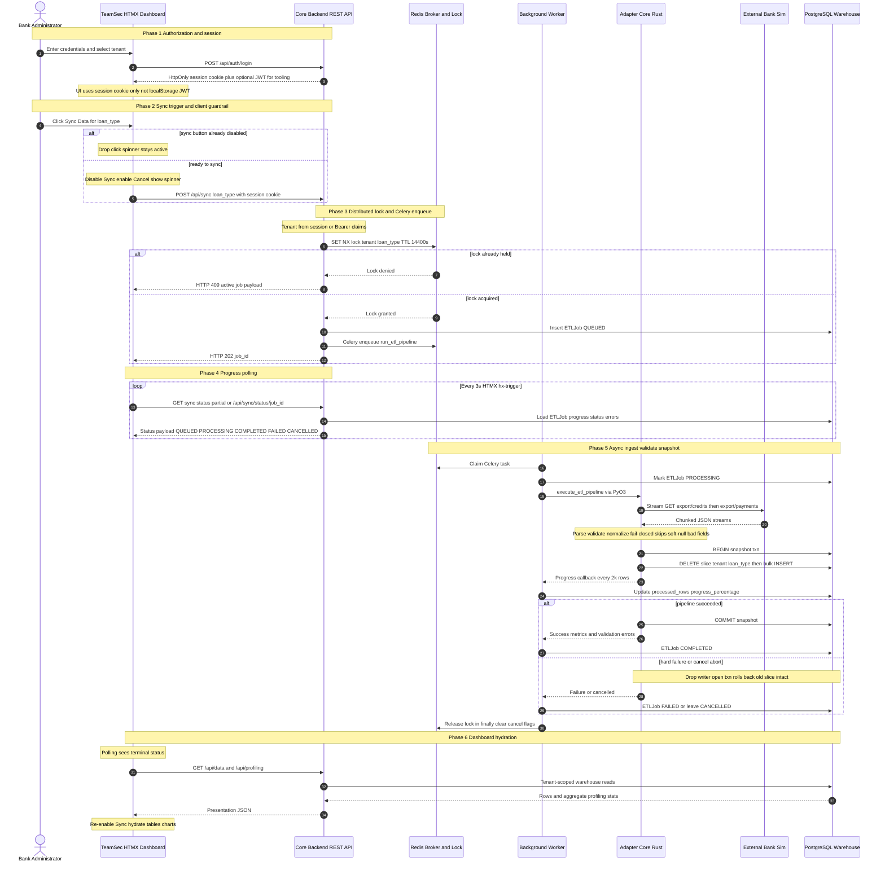
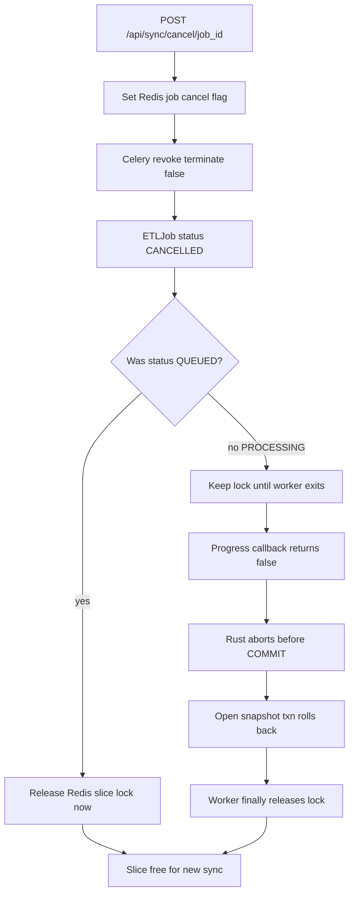

# System Design Map

## Overview

Teamsec is a multi-tenant ETL financial data platform that ingests loan data from an external bank API, processes it through a native Rust pipeline, and persists results in a PostgreSQL warehouse. A Django gateway exposes REST endpoints, session-based operator authentication (optional Bearer JWT for tooling), and an HTMX web UI. Background processing is handled by Celery workers that embed the compiled `adapter_core` PyO3 module.

## Runtime Topology

```
┌─────────────────────────────────────────────────────────────────────┐
│                        teamsec_network (bridge)                     │
│                                                                     │
│  ┌──────────────┐   ┌──────────────┐   ┌────────────────────────┐ │
│  │ postgres_    │   │ redis_       │   │ external_bank_sim :8080│ │
│  │ warehouse    │   │ broker       │   │ (fake bank REST API)   │ │
│  │ :5432        │   │ :6379        │   └───────────┬────────────┘ │
│  └──────┬───────┘   └──────┬───────┘               │              │
│         │                  │                        │ HTTP         │
│         │                  │                        ▼              │
│  ┌──────┴──────────────────┴──────────────────────────────────┐   │
│  │              core_backend_api :8000                        │   │
│  │  Django REST Framework · Session Auth · HTMX Dashboard     │   │
│  └──────────────────────────┬─────────────────────────────────┘   │
│                             │ Celery enqueue                     │
│                             ▼                                    │
│  ┌──────────────────────────────────────────────────────────┐   │
│  │              background_worker                            │   │
│  │  Celery daemon · adapter_core (Rust/PyO3 via Maturin)     │   │
│  └──────────────────────────────────────────────────────────┘   │
└─────────────────────────────────────────────────────────────────────┘
```

## Component Responsibilities

### external_bank/
Isolated Django application simulating a third-party bank. Stores CSV portfolios on disk and streams JSON arrays at `/api/bank/export/credits` and `/api/bank/export/payments`. Runs on port 8080 with SQLite metadata. Unauthenticated by design for local demos.

### api/
Django gateway handling:
- Auth and health (`/api/auth/login`, `/api/auth/logout`, `/api/auth/session`, `/api/health/`)
- Sync orchestration (`/api/sync`, status, cancel, active)
- Warehouse snapshot and profiling (`/api/data`, `/api/profiling`)
- HTMX dashboard (`/login/`, `/dashboard/`)
- Redis distributed lock per `tenant_id` + `loan_type`
- Celery task dispatch to `background_worker`

### adapter/
Rust core compiled as a `cdylib` via Maturin/PyO3. Exposes `execute_etl_pipeline(...)` to Python. Streams bank JSON over HTTP (`reqwest`), validates rows (`rust_decimal` / date parsers), and batch-writes into Postgres inside a single snapshot transaction (delete tenant+loan_type slice, then insert). Tokio work runs with the GIL released; progress callbacks re-acquire the GIL briefly.

### background_worker
Headless Celery worker container. Builds and installs `adapter_core` at image build time, then processes `run_etl_pipeline` tasks asynchronously.

## Data Flow

1. Operator authenticates via `POST /api/auth/login` (HttpOnly session cookie) and triggers sync via HTMX dashboard or `POST /api/sync`.
2. `core_backend_api` acquires a Redis lock (`lock:{tenant}:{loan_type}`, TTL 14400s), creates an `ETLJob`, and enqueues Celery.
3. `background_worker` calls `adapter_core.execute_etl_pipeline()` with bank export URLs and the warehouse DB URL.
4. Rust adapter streams credits then payments, validates rows, and commits a tenant snapshot to `postgres_warehouse`.
5. Progress updates the Django job record; the lock is released when the Celery task exits (`finally`). Cancel sets a Redis flag and soft-revokes the task; the Python progress callback returns `false` so Rust aborts before commit (open snapshot txn rolls back). For **PROCESSING** jobs the lock stays held until that worker finishes so a new sync cannot write the same slice concurrently. **QUEUED** cancels release the lock immediately (no writer started).
6. Dashboard hydrates via `GET /api/data` and `GET /api/profiling` — post-ingest Django aggregates over the warehouse (not streaming profiler stats inside Rust).

### Sync process

Six-phase sync matching the as-built system (session-first HTMX UI, Celery + Postgres job state, dual bank exports, Django-side profiling).



### Cancel process

Cooperative abort path added beyond the baseline sync design.



## Validation Policy

Missing `loan_account_number` (credits) or payments referencing unknown accounts are **fail-closed** — the row is skipped and logged. Invalid dates/numerics on otherwise accepted rows are **soft**: the bad field is stored as null, the row is still written, and an error is appended to the job log. Prefer clean bank exports for a clean warehouse.

## Multi-Tenancy Model

Tenants are fixed demo IDs (`BANK001`, `BANK002`, `BANK003`) propagated through session/JWT claims, ETL job records, bank storage paths, and warehouse rows. Loan types are `RETAIL` and `COMMERCIAL`. Concurrent syncs for the same tenant are allowed across loan types; the same tenant+loan_type pair is serialized by the Redis lock.

## Technology Stack

| Layer            | Technology                          |
|------------------|-------------------------------------|
| API Gateway      | Django 5+, DRF, HTMX                |
| Auth             | Django session cookie (+ optional Bearer JWT for tooling) |
| Task Queue       | Celery + Redis 7                    |
| Data Warehouse   | PostgreSQL 15                       |
| ETL Engine       | Rust (PyO3, Maturin)                |
| Orchestration    | Docker Compose                      |
